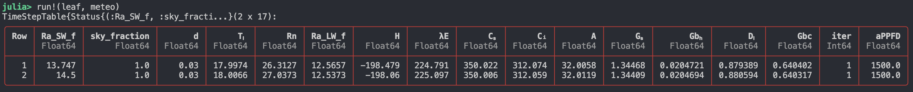

# PlantBiophysics

[](https://VEZY.github.io/PlantBiophysics.jl/stable)
[](https://VEZY.github.io/PlantBiophysics.jl/dev)
[](https://github.com/VEZY/PlantBiophysics.jl/actions)
[](https://github.com/invenia/BlueStyle)
[](https://github.com/SciML/ColPrac)
[](https://github.com/JuliaTesting/Aqua.jl)
[](https://zenodo.org/badge/latestdoi/321699417)

A pure Julia package to simulate biophysical processes for plants such as photosynthesis, conductances for heat, water vapor and CO₂, latent, sensible energy fluxes, net radiation and temperature.

The benefits of using this package are:

- Blazing fast (few μs for the whole energy balance + photosynthesis + conductances)
- Easy to use and interactive
- Parameter calibration and simulation in one place, works with DataFrames and MTGs
- Great composability:
  - easy to extend, add your model for any process, and it just works, with automatic coupling with other models
  - easy to integrate into other models or platforms thanks to Julia's great compatibility with other languages
- Easy to read, the code implements the equations close to how they are written in the scientific articles (thanks Julia Unicode!)
- Compatible with other simulation platforms thanks to the MTG format (OpenAlea, ARCHIMED, AMAPStudio...)
- Error propagation using [Measurements.jl](https://juliaphysics.github.io/Measurements.jl/stable/) or [MonteCarloMeasurements.jl](https://baggepinnen.github.io/MonteCarloMeasurements.jl/stable/)

## Try it!

Start by creating a new environment for your project using the pkg manager. To enter the package manager, just press `]` in the REPL, and it will become blue (press backspace to return to the Julia REPL). Then create the environment using this command:

```julia
activate .
```

Don't forget the "."! It is used to tell the pkg manager that you activate the project were you currently are.

You can then install PlantBiophysics using this command (still from the pkg manager):

```julia
add PlantBiophysics
```

## Examples

Here is an example usage with a simulation of the energy balance and assimilation of a leaf.

> Note that PlantBiophysics is an extension of PlantSimEngine, so we must import both to make a simulation

```julia
# Import the packages (you need to install PlantSimEngine first):
using PlantBiophysics, PlantSimEngine

# Declare the meteorology for the simulated time-step (also possible to import meteo files):
meteo = Atmosphere(T = 22.0, Wind = 0.8333, Rh = 0.4490995)

# Using the model from Medlyn et al. (2011) for Gs and the model of Monteith and Unsworth (2013) for the energy balance:
leaf = ModelList(
    energy_balance = Monteith(),
    photosynthesis = Fvcb(),
    stomatal_conductance = Medlyn(0.03, 12.0),
    status = (Ra_SW_f = [13.747, 14.5], sky_fraction = 1.0, aPPFD = 1500.0, d = 0.03)
)

run!(leaf, meteo)
```



For more examples, please read the documentation.

## Ask Questions

If you have any questions or feedback, [open an issue](https://github.com/VEZY/PlantBiophysics.jl/issues) or ask on [discourse](https://fspm.discourse.group/c/software/virtual-plant-lab).

## Contributing

Contributions are welcome! If you develop a model for a process, please make a pull request so the community can enjoy it!

See contributor's guide badge for more informations: [](https://github.com/SciML/ColPrac).

## Similar projects

- [MAESPA](http://maespa.github.io/) model, in FORTRAN.
- [photosynthesis](https://github.com/cran/photosynthesis) R package
- [plantecophys](https://bitbucket.org/remkoduursma/plantecophys/src/master/) R package
- [LeafGasExchange](https://github.com/cropbox/LeafGasExchange.jl) another Julia package

## References

Baldocchi, Dennis. 1994. « An analytical solution for coupled leaf photosynthesis and
stomatal conductance models ». Tree Physiology 14 (7-8‑9): 1069‑79.
<https://doi.org/10.1093/treephys/14.7-8-9.1069>.

Duursma, R. A., et B. E. Medlyn. 2012. « MAESPA: a model to study interactions between water
limitation, environmental drivers and vegetation function at tree and stand levels, with an
example application to [CO2] × drought interactions ». Geoscientific Model Development 5
(4): 919‑40. <https://doi.org/10.5194/gmd-5-919-2012>

Farquhar, G. D., S. von von Caemmerer, et J. A. Berry. 1980. « A biochemical model of
photosynthetic CO2 assimilation in leaves of C3 species ». Planta 149 (1): 78‑90.

Leuning, R., F. M. Kelliher, DGG de Pury, et E.-D. SCHULZE. 1995. « Leaf nitrogen,
photosynthesis, conductance and transpiration: scaling from leaves to canopies ». Plant,
Cell & Environment 18 (10): 1183‑1200.

Medlyn, B. E., E. Dreyer, D. Ellsworth, M. Forstreuter, P. C. Harley, M. U. F. Kirschbaum, X. Le Roux, et al. 2002. « Temperature response of parameters of a biochemically based model of photosynthesis. II. A review of experimental data ». Plant, Cell & Environment 25 (9): 1167‑79. <https://doi.org/10.1046/j.1365-3040.2002.00891.x>.

Monteith, John L., et Mike H. Unsworth. 2013. « Chapter 13 - Steady-State Heat Balance: (i) Water Surfaces, Soil, and Vegetation ». In Principles of Environmental Physics (Fourth Edition), edited by John L. Monteith et Mike H. Unsworth, 217‑47. Boston: Academic Press.

Schymanski, Stanislaus J., et Dani Or. 2017. « Leaf-Scale Experiments Reveal an Important
Omission in the Penman–Monteith Equation ». Hydrology and Earth System Sciences 21 (2): 685‑706. <https://doi.org/10.5194/hess-21-685-2017>.

Vezy, Rémi, Mathias Christina, Olivier Roupsard, Yann Nouvellon, Remko Duursma, Belinda Medlyn, Maxime Soma, et al. 2018. « Measuring and modelling energy partitioning in canopies of varying complexity using MAESPA model ». Agricultural and Forest Meteorology 253‑254 (printemps): 203‑17. <https://doi.org/10.1016/j.agrformet.2018.02.005>.
