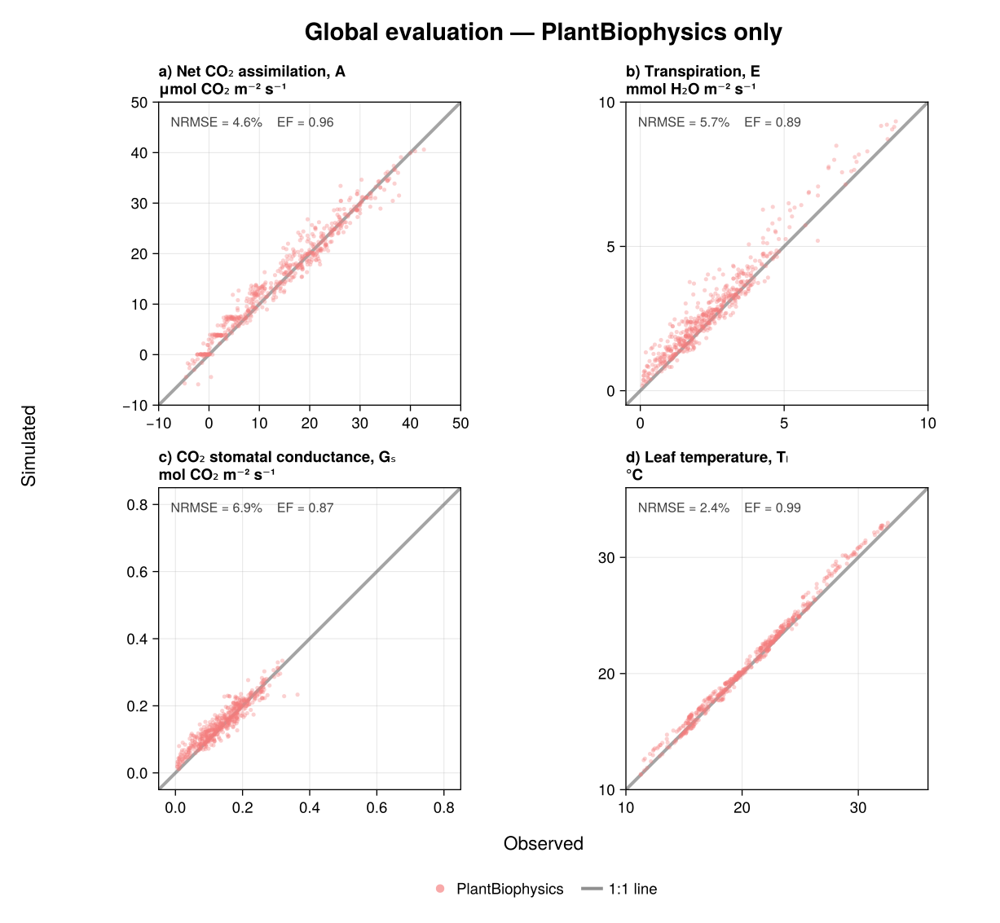
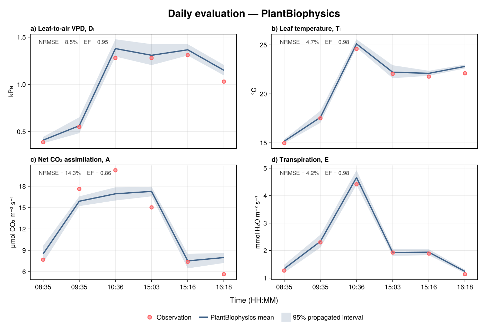
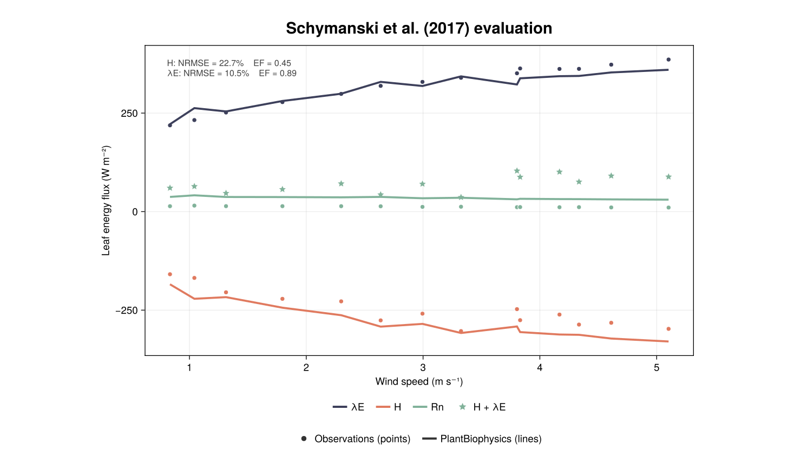

# Model evaluation

This page compares PlantBiophysics simulations with empirical measurements
used in the package paper. Only PlantBiophysics results are shown: the global
figure deliberately omits the other models compared in the original paper.

Each panel reports the normalized root mean squared error (NRMSE, normalized by
the observed range) and modelling efficiency (EF) for the current simulation.
The same scenarios feed the figures and the automated regression tests, so the
visual and numerical evaluations use identical inputs, parameters, filters,
and unit conversions.

!!! note "Numerical regression gate"
    The tests compare the current NRMSE, RMSE, bias, normalized bias, and EF
    against the statistics from the `main` branch of the paper repository.
    Tolerances account for floating-point and dependency differences. The
    checks are one-sided: better model skill passes, while a meaningful loss of
    skill fails.

## Global evaluation



The coupled FvCB--Medlyn--Monteith simulation is evaluated against the
Tumbarumba gas-exchange measurements from
[Medlyn, Pepper, and Keith (2015)](https://doi.org/10.6084/m9.figshare.1538079.v1).
The paper's `Ca > 150 ppm` quality filter leaves 536 observations. Each
observation is evaluated once; this avoids the duplicated timestamp matches in
the historical paper workflow. The grey line is the 1:1 relationship.

## Daily evaluation



This six-observation sequence is for tree 3 on 14 November 2001 in the same
Tumbarumba dataset. The line is the mean of 2,000 uncertainty-propagation
particles, and the shaded ribbon spans their 2.5th to 97.5th percentiles.

Measured stomatal conductance is forced in this scenario because these spot
measurements do not provide the response curve needed to fit a stomatal model.
The figure therefore evaluates the photosynthesis and energy-balance response
conditional on measured conductance; it is not an independent validation of
stomatal conductance.

## Schymanski et al. (2017)



Points are observations and lines are PlantBiophysics simulations for the
wind-speed experiment underlying figure 6a of
[Schymanski and Or (2017)](https://doi.org/10.5194/hess-21-685-2017).
The plotted fluxes are latent heat (`λE`), sensible heat (`H`), net radiation
(`Rn`), and the observed energy sum (`H + λE`).

Measured stomatal conductance, radiative forcing, and chamber conditions are
prescribed. This is consequently a targeted evaluation of the energy-balance
implementation rather than a fully independent evaluation of the coupled
leaf model. The source data come from the
[`Schymanski_leaf-scale_2016`](https://github.com/schymans/Schymanski_leaf-scale_2016)
repository.

## Reproducing the figures

The SVG files are regenerated at the start of every Documenter build. Once the
dedicated figure environment is instantiated, generation uses only the
committed offline test fixtures. To regenerate the figures without building
the rest of the documentation, run:

```bash
julia --project=docs/figures -e 'using Pkg; Pkg.instantiate()'
julia --project=docs/figures docs/figures/generate_evaluation_figures.jl
```

The Medlyn fixtures are distributed under CC BY 4.0. Their file identifiers,
checksums, extraction history, and the provenance note for the Schymanski data
are recorded in `test/inputs/evaluation/README.md`.
