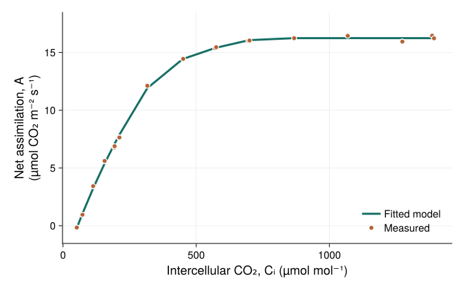

```@meta
CurrentModule = PlantBiophysics
```

# From measurements to whole plants

Fit a model to leaf measurements, then explore how individual leaves contribute
to the exchanges of a whole plant.

```@raw html
<div class="pb-home-results">
  <figure>
    
    <figcaption>
      <strong>Fit photosynthesis to measurements</strong>
      <p>Estimate photosynthetic capacities from gas-exchange measurements and compare the fitted response with the observations.</p>
      <a href="fitting/parameter_fitting.html">Try the fitting example →</a>
    </figcaption>
  </figure>
  <figure>
    <video class="pb-result-media" controls muted loop playsinline preload="none" poster="assets/home-oil-palm-assimilation.png" aria-label="Oil-palm photosynthesis through the day under three chamber scenarios" width="1800" height="1000">
      <source src="assets/home-oil-palm-assimilation.mp4" type="video/mp4">
      <a href="assets/home-oil-palm-assimilation.mp4">Watch the oil-palm simulation.</a>
    </video>
    <figcaption>
      <strong>See photosynthesis through the day</strong>
      <p>Leaf colours show net CO₂ uptake in a young oil palm under three chamber scenarios. An animation from the FSPM 2023 example.</p>
      <a href="simulation/mtg_simulation.html#fspm_2023_oil_palm">Explore the 3D simulation →</a>
    </figcaption>
  </figure>
</div>
```

## Your first leaf simulation

PlantBiophysics is a Julia package for simulating photosynthesis, stomatal
conductance, leaf temperature, and exchanges of heat and water. It also
provides simple canopy light-interception models.

The models run together through PlantSimEngine and can be applied to one
leaf, several organs, or a whole plant.

If you are new to the package, the [Design page](concepts/package_design.md)
introduces processes, models, parameters, and simulation inputs.

## Installation

In the Julia REPL, press `]` to enter package mode, then install the packages
used in the examples:

```text
pkg> add PlantBiophysics PlantSimEngine PlantMeteo
```

Press Backspace to return to the Julia prompt.

## Quick Start

This example combines an energy-balance model (`Monteith`), a photosynthesis
model (`Fvcb`), and a stomatal-conductance model (`Medlyn`) for one leaf.
The input values are illustrative.

```@example home
using PlantBiophysics, PlantSimEngine, PlantMeteo, Dates

meteo = Atmosphere(
    T=22.0,
    Wind=0.8333,
    P=101.325,
    Rh=0.45,
    duration=Hour(1),
)

scene = leaf_scene(
    Monteith(),
    Fvcb(),
    Medlyn(0.03, 12.0);
    status=Status(
        Ra_SW_f=13.747,
        sky_fraction=1.0,
        aPPFD=1500.0,
        d=0.03,
    ),
    environment=meteo,
)

simulation = run!(scene)
leaf = only(model_objects(scene; scale=:Leaf))
(Tₗ=leaf.status.Tₗ, A=leaf.status.A, Gₛ=leaf.status.Gₛ)
```

`leaf_scene` brings the models, leaf inputs, and weather together. `run!`
calculates their results, which remain available on the leaf's `status`.
The values shown are leaf temperature (`Tₗ`, °C), net CO₂ assimilation
(`A`, µmol CO₂ m⁻² s⁻¹), and stomatal conductance to CO₂
(`Gₛ`, mol CO₂ m⁻² s⁻¹).

## Next Steps

- [First simulation](simulation/first_simulation.md): understand each step.
- [Several time steps](simulation/several_simulation.md): use changing weather
  and collect a table of results.
- [Models](models/photosynthesis.md): choose equations and parameters.
- [Model evaluation](evaluation.md): compare simulations with measurements.
- [Whole-plant simulation](simulation/mtg_simulation.md): apply models to organs.
- [Implement a model](extending/implement_a_model.md): add your own equations.
- [API reference](functions.md): look up individual functions.
