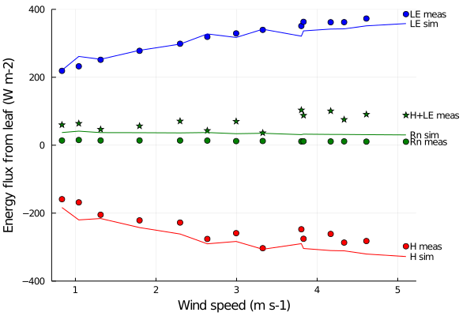

# [Energy balance](@id nrj_page)

```@setup usepkg
using PlantBiophysics, PlantSimEngine
```

The energy balance is the process of computing the balance between influx and outflux of energy in all its form: latent and sensible heat, thermal radiation...

## Models overview

Only one model is available to-date:

- [`Monteith`](@ref): an implementation of the Monteith et al. (2013) model

You can choose which model to use by passing a model list with an energy balance model set to one of the `structs` above:

```@example usepkg
using PlantBiophysics, PlantSimEngine

meteo = Atmosphere(T = 20.0, Wind = 1.0, P = 101.3, Rh = 0.65)

leaf = ModelList(
    Monteith(),
    Fvcb(),
    Medlyn(0.03, 12.0),
    status = (Ra_SW_f = 13.747, sky_fraction = 1.0, aPPFD = 1500.0, d = 0.03)
)

run!(leaf,meteo)
leaf[:Rn]
```

## Monteith

Leaf energy balance according to Monteith and Unsworth (2013), and corrigendum from Schymanski et al. (2017). The computation is close to the one from the MAESPA model (Duursma et al., 2012, Vezy et al., 2018) here. The leaf temperature is computed iteratively to close the energy balance using the mass flux (~ Rn - λE).

### [Parameters](@id param_monteith)

The Monteith model has the following set of parameters:

- `aₛₕ = 2`: number of faces of the object that exchange sensible heat fluxes
- `aₛᵥ = 1`: number of faces of the object that exchange latent heat fluxes (hypostomatous => 1)
- `ε = 0.955`: emissivity of the object
- `maxiter = 10`: maximal number of iterations allowed to close the energy balance
- `ΔT = 0.01` (°C): maximum difference in object temperature between two iterations to consider convergence

!!! note
    Objects are surfaces, not volumes, so the maximum number of faces is two.

### [Input variables](@id inputs_monteith)

The [`Monteith`](@ref) model needs three input variables:

```@example usepkg
inputs(Monteith())
```

`Ra_SW_f` (W m-2) is the net shortwave radiation (PAR + NIR), most often computed from a light interception model. `sky_fraction` (0-2) is the fraction of sky the object is viewing compared to everything else. It is given for the 360° viewing angle, *i.e.* for both faces. `d` (m) is the characteristic dimension, *e.g.* the leaf width (see eq. 10.9 from Monteith and Unsworth, 2013).

!!! note
    `sky_fraction` is equal to `2` if the leaf is viewing sky only (*e.g.* in a controlled chamber with lights everywhere), `1` if the leaf is *e.g.* up on the canopy where the upper side of the leaf sees sky, and the bottom side sees soil and other components, or less than 1 if it is partly shaded. `sky_fraction` is used to compute the thermal radiation exchanges. Everything except the sky is considered at the same temperature than the object. This simplification makes the computations very fast, but less precise, especially when another object has a very different temperature.

### [Output variables](@id outputs_monteith)

The [`Monteith`](@ref) model computes a lot of variables, mainly because it is also coupled to a photosynthesis model, itself potentially coupled to a stomatal conductance model:

```@example usepkg
outputs(Monteith())
```

`Tₗ` (°C) is the component temperature, `Rn` (``W \cdot m^{-2}``) is the net radiation (PAR + NIR + TIR), `Ra_LW_f` (``W \cdot m^{-2}``) is the longwave radiation (TIR), `H` (``W \cdot m^{-2}``) is the sensible heat flux, `λE` (``W \cdot m^{-2}``) is the latent heat flux, `Cₛ` (ppm) is the stomatal CO₂ concentration, `Cᵢ` (ppm) is the intercellular CO₂ concentration, `A` (``μmol \cdot m^{-2} \cdot s^{-1}``) is the CO₂ assimilation rate, `Gₛ` (``mol_{CO_2} \cdot m^{-2} \cdot s^{-1}``) the stomatal conductance, `Gbₕ` (``m \cdot s^{-1}``) the boundary layer conductance to heat, `Dₗ` (kPa) the difference between the vapour pressure at the leaf surface and the saturated air vapour pressure, `Gbc` (``mol_{CO_2} \cdot m^{-2} \cdot s^{-1}``) the boundary layer conductance to CO₂, and `iter` the number of iterations to reach convergence.

!!! note
    The output variables depends on the models we are using for photosynthesis and stomatal conductance.

!!! note
    Convergence is reached whenever the difference in the component temperature (`Tₗ`, °C) between two time-steps is lower than `ΔT`.

### [Example](@id exemple_monteith)

Here is an example usage:

```@example usepkg
meteo = Atmosphere(T = 22.0, Wind = 0.8333, P = 101.325, Rh = 0.4490995)

leaf = ModelList(
    Monteith(),
    Fvcb(),
    Medlyn(0.03, 12.0),
    status = (Ra_SW_f = 13.747, sky_fraction = 1.0, aPPFD = 1500.0, d = 0.03)
)

leaf
```

The Monteith model implementation can be tested on the data provided by Schymanski et al. (2017). Here is a figure comparing our implementation and the data:

```@setup schymanskifig6a
include("./schymanski.jl")
```



*Figure 1. Energy flux measured on an artificial leaf (points) or simulated from its digital twin (lines). Data from Schymanski et al. (2017) figure 6a. The code to reproduce this figure is available in [this file](./schymanski.jl).*

## References

Duursma, R. A., et B. E. Medlyn. 2012. « MAESPA: a model to study interactions between water limitation, environmental drivers and vegetation function at tree and stand levels, with an example application to [CO2] × drought interactions ». Geoscientific Model Development 5 (4): 919‑40. <https://doi.org/10.5194/gmd-5-919-2012>.

Monteith, John L., et Mike H. Unsworth. 2013. « Chapter 13 - Steady-State Heat Balance: (i) Water Surfaces, Soil, and Vegetation ». In Principles of Environmental Physics (Fourth Edition), edited by John L. Monteith et Mike H. Unsworth, 217‑47. Boston: Academic Press.

Schymanski, Stanislaus J., et Dani Or. 2017. « Leaf-Scale Experiments Reveal an Important Omission in the Penman–Monteith Equation ». Hydrology and Earth System Sciences 21 (2): 685‑706. <https://doi.org/10.5194/hess-21-685-2017>.

Vezy, Rémi, Mathias Christina, Olivier Roupsard, Yann Nouvellon, Remko Duursma, Belinda Medlyn, Maxime Soma, et al. 2018. « Measuring and modelling energy partitioning in canopies of varying complexity using MAESPA model ». Agricultural and Forest Meteorology 253‑254 (printemps): 203‑17. <https://doi.org/10.1016/j.agrformet.2018.02.005>.
